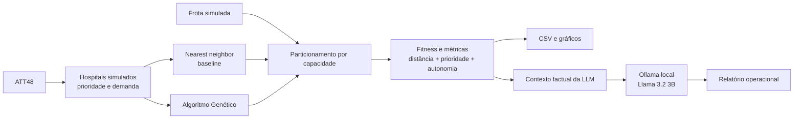

# Otimização de rotas hospitalares com Algoritmo Genético

Projeto do Tech Challenge FIAP para otimizar a distribuição de insumos entre hospitais. O problema é modelado como uma extensão do Problema do Caixeiro-Viajante (TSP): além da distância, a avaliação considera a prioridade das entregas, a capacidade dos veículos, sua autonomia e o uso de múltiplas rotas.

O projeto compara um Algoritmo Genético (GA) com uma heurística de referência *nearest neighbor* (vizinho mais próximo), gera resultados reproduzíveis e gráficos e, opcionalmente, usa uma LLM executada localmente para transformar as métricas em um relatório operacional.

> **Importante:** este é um cenário de simulação. As coordenadas do ATT48 são reescaladas para a área da visualização; por isso, as distâncias são **unidades escaladas da simulação**, não quilômetros. Prioridades e demandas também são dados simulados e determinísticos, não dados reais de hospitais.

## Cenário modelado

- 48 pontos do benchmark ATT48 são tratados como hospitais.
- O Hospital 1 é mantido como ponto inicial de todas as soluções.
- As prioridades seguem deterministicamente o ciclo `1, 2, 3`.
- As demandas seguem deterministicamente o ciclo `10, 20, 30, 40, 50`.
- A frota contém 8 veículos, cada um com capacidade `250.0` e autonomia `900.0` unidades da simulação.
- No conjunto de resultados versionado, as entregas são divididas em 6 rotas.

O fitness é minimizado e soma, para todas as rotas:

1. distância euclidiana total;
2. penalidade de prioridade, que cresce com a distância acumulada até cada entrega e com o valor de sua prioridade;
3. penalidade de autonomia, aplicada quando a distância de uma rota excede a autonomia do veículo.

## Arquitetura



Os principais componentes são:

- `genetic_algorithm.py`: população, distância, fitness hospitalar, crossover, mutação e ordenação.
- `ga_runner.py`: execução do GA com elitismo, seleção ponderada e seed opcional.
- `routing.py`: divisão sequencial das entregas entre veículos, métricas da frota e penalidade de autonomia.
- `nearest_neighbor.py`: baseline guloso do vizinho mais próximo.
- `tsp.py`: cenário principal e visualização interativa com Pygame.
- `experiments.py`: cinco execuções reproduzíveis do GA e exportação dos CSVs.
- `plot_results.py`: geração dos gráficos a partir dos CSVs.
- `llm/`: cliente local do Ollama, preparação do contexto, prompts e serviço de relatório.
- `demo_llm.py`: demonstração completa do GA, comparação com o baseline e relatório via LLM.
- `tests/`: testes automatizados do GA, roteamento, modelos, baseline e integração LLM.

## Execução rápida

O caminho principal foi validado com **Python 3.13.15**. No PowerShell, a partir da raiz do repositório:

```powershell
python -m venv .venv
.\.venv\Scripts\Activate.ps1
python -m pip install -r requirements.txt
python tsp.py
```

O último comando abre a visualização do Pygame. Pressione `Q` ou feche a janela para encerrar.

## Preparação do ambiente

Execute os comandos a partir da raiz do repositório.

### Opção 1 — `venv` e `pip`

Esta é a opção recomendada. O projeto foi validado com Python 3.13.15; crie o ambiente virtual:

```powershell
python -m venv .venv
```

No PowerShell, ative-o com:

```powershell
.\.venv\Scripts\Activate.ps1
```

No Linux ou macOS:

```bash
source .venv/bin/activate
```

Instale as dependências:

```powershell
python -m pip install -r requirements.txt
```

### Opção 2 — Conda (legada)

O arquivo `environment.yml` é uma configuração legada, fixada em Python 3.9.19 e em versões antigas das dependências. Ele é mantido para referência e reprodução do ambiente anterior, mas não representa o ambiente atualmente validado. Para recriá-lo:

```powershell
conda env create --file environment.yml
conda activate fiap_tsp
```

## Executar o sistema principal

```powershell
python tsp.py
```

O programa executa o GA com seed `42`, abre uma janela do Pygame com as rotas e a evolução do fitness e, após o fechamento, imprime no terminal a comparação detalhada com o baseline. Pressione `Q` ou feche a janela para encerrar.

Configuração atual do fluxo principal:

- população: 100 indivíduos;
- gerações: 200;
- probabilidade de mutação: 0,5;
- crossover: *order crossover*;
- mutação: troca de duas entregas adjacentes, preservando o ponto inicial;
- elitismo: a melhor solução passa para a geração seguinte;
- baseline inserido como o primeiro indivíduo da população inicial.

## Experimentos e gráficos

Para executar o GA com as seeds `1, 2, 3, 4, 5` e atualizar os resultados tabulares:

```powershell
python experiments.py
```

Esse comando grava:

- `results/ga_experiments.csv`: métricas finais de cada seed;
- `results/ga_convergence.csv`: melhor fitness por geração e seed.

Em seguida, gere os gráficos:

```powershell
python plot_results.py
```

As imagens são gravadas em `results/plots/`:

- `fitness_by_seed.png`: fitness final do GA por seed e linha do baseline;
- `distance_by_seed.png`: distância final por seed e linha do baseline;
- `fitness_difference.png`: diferença percentual de fitness contra o baseline;
- `ga_convergence.png`: convergência ao longo das 200 gerações.

## Resultados conhecidos

Os valores abaixo vêm dos arquivos atualmente versionados em `results/`, gerados com população 100, 200 gerações, mutação 0,5 e cinco seeds.

### Baseline nearest neighbor

| Métrica | Valor |
|---|---:|
| Fitness | 27.971,74 |
| Distância | 3.466,52 unidades da simulação |
| Penalidade de prioridade | 24.505,22 |
| Penalidade de autonomia | 0,00 |
| Rotas | 6 |

### Algoritmo Genético — cinco seeds

| Métrica | Valor |
|---|---:|
| Fitness médio | 25.962,64 |
| Melhor fitness | 25.701,60 (seed 5) |
| Pior fitness | 26.251,06 |
| Desvio-padrão do fitness | 238,18 |
| Distância média | 3.321,27 unidades da simulação |
| Melhor distância | 3.258,77 unidades da simulação |
| Pior distância | 3.387,50 unidades da simulação |
| Diferença média de fitness vs. baseline | -7,18% |

Nas cinco execuções registradas, o fitness do GA ficou entre **6,15% e 8,12% menor** que o baseline. Como fitness menor é melhor, todas as seeds superaram a solução de referência nessa função de avaliação.

O melhor experimento registrado, seed 5, obteve:

| Métrica | GA | Baseline | Diferença do GA |
|---|---:|---:|---:|
| Fitness | 25.701,60 | 27.971,74 | 8,12% menor |
| Distância | 3.258,77 | 3.466,52 | 5,99% menor |
| Penalidade de prioridade | 22.442,82 | 24.505,22 | 8,42% menor |
| Penalidade de autonomia | 0,00 | 0,00 | sem penalidade em ambos |
| Rotas | 6 | 6 | igual |

Esses resultados mostram o desempenho nas seeds e nos parâmetros testados. O GA é uma meta-heurística e o projeto não demonstra que a solução encontrada seja o ótimo global.

## Integração LLM local com Ollama

A LLM é opcional e usada somente para redigir um relatório a partir das métricas calculadas pelo código. Ela **não escolhe nem altera as rotas**.

A integração atual usa:

- Ollama em `http://localhost:11434`;
- modelo `llama3.2:3b`;
- API HTTP local do Ollama por meio da biblioteca padrão do Python;
- temperatura baixa e contexto resumido com valores calculados pelo projeto;
- validação do texto e relatório determinístico de fallback quando a saída contém alegações bloqueadas.

Não há integração com OpenAI ou outro provedor de nuvem, não há API key e não há billing de API. O modelo roda localmente no computador. A internet é necessária para instalar o Ollama e baixar o modelo pela primeira vez; depois, a inferência desta aplicação é feita contra o serviço local. Recursos de cloud são opcionais no ecossistema e não são utilizados por este projeto.

### Instalar e preparar o Ollama

1. Baixe e instale o Ollama para o seu sistema em [ollama.com/download](https://ollama.com/download). No Windows, o instalador mantém o Ollama em execução em segundo plano.
2. Baixe o modelo configurado no projeto:

```powershell
ollama pull llama3.2:3b
```

3. Se o serviço não estiver em execução no seu sistema, inicie-o em outro terminal:

```powershell
ollama serve
```

O cliente espera a API local padrão na porta `11434`. O download do modelo ocupa espaço em disco, e velocidade e consumo de memória dependem do hardware local.

### Executar a demo LLM

Com o Ollama ativo e o modelo baixado:

```powershell
python demo_llm.py
```

A demonstração usa a seed 5, executa o GA, mostra as diferenças de fitness, distância e prioridade contra o baseline e solicita ao Llama 3.2 3B um relatório em português brasileiro. Se o Ollama estiver indisponível, a demo termina com uma mensagem de erro de conexão; o fallback existente valida conteúdo inadequado retornado pelo modelo, mas não substitui um serviço Ollama ausente.

Para testar apenas a comunicação local de forma interativa:

```powershell
python test_llm_local.py
```

## Testes

O conjunto de testes não exige que o Ollama esteja em execução: as chamadas HTTP são simuladas nos testes automatizados.

```powershell
python -m pytest
```

## Restrições e limitações reais

- **Capacidade:** é uma restrição dura no particionamento. As entregas são percorridas na ordem da solução e uma nova rota é aberta quando a próxima demanda excederia a capacidade do veículo. Uma demanda individual maior que a capacidade ou uma frota insuficiente gera erro.
- **Múltiplos veículos:** cada rota criada é associada sequencialmente a um veículo disponível. Embora a frota configurada tenha 8 veículos, o cenário atual usa 6 rotas.
- **Autonomia:** é uma restrição suave. Excedê-la adiciona ao fitness o excesso de distância multiplicado por `1000`; o algoritmo não impede fisicamente uma rota acima da autonomia.
- **Divisão das rotas:** o GA otimiza uma única permutação global. A separação em rotas ocorre depois, de modo guloso e sequencial, conforme a capacidade; o ponto de corte das rotas e a atribuição de veículos não possuem operadores genéticos próprios.
- **Dados:** nomes, coordenadas reescaladas, prioridades, demandas, capacidades e autonomias são simulados. Não há trânsito, janelas de atendimento, tempo de serviço, custos, tipos de carga, vias reais ou geolocalização.
- **Unidades:** as coordenadas ATT48 são escaladas separadamente nos eixos para caber na tela. As distâncias resultantes não representam quilômetros nem preservam necessariamente a escala original do benchmark.
- **Baseline:** nearest neighbor é uma referência heurística, não uma solução ótima comprovada.
- **LLM:** o texto gerado pode variar. Os números continuam vindo do algoritmo, e o serviço aplica instruções e um fallback factual, mas a demo requer o Ollama local disponível.
- **Reprodutibilidade:** os scripts usam seeds definidas; resultados podem variar se parâmetros, código, versões de dependências ou ambiente forem alterados.

## Estrutura do projeto

```text
.
├── benchmark_att48.py       # dados do benchmark ATT48
├── genetic_algorithm.py     # operadores e funções de fitness
├── ga_runner.py             # ciclo de execução do GA
├── routing.py               # frota, capacidade, autonomia e métricas
├── nearest_neighbor.py      # solução de referência
├── models.py                # modelo de entrega/hospital
├── vehicle.py               # modelo de veículo
├── tsp.py                   # aplicação principal com Pygame
├── draw_functions.py        # desenho de rotas e convergência
├── experiments.py           # experimentos com cinco seeds
├── plot_results.py          # geração dos gráficos
├── demo_llm.py              # GA + relatório por LLM local
├── test_llm_local.py        # teste manual do cliente Ollama
├── llm/                     # cliente, contexto, prompts e serviço LLM
├── tests/                   # testes automatizados
├── results/                 # CSVs e gráficos gerados
├── requirements.txt         # dependências do ambiente atualmente validado
└── environment.yml          # configuração Conda legada (Python 3.9.19)
```

## Licença

Este projeto é distribuído sob a licença presente em [LICENSE](LICENSE).
